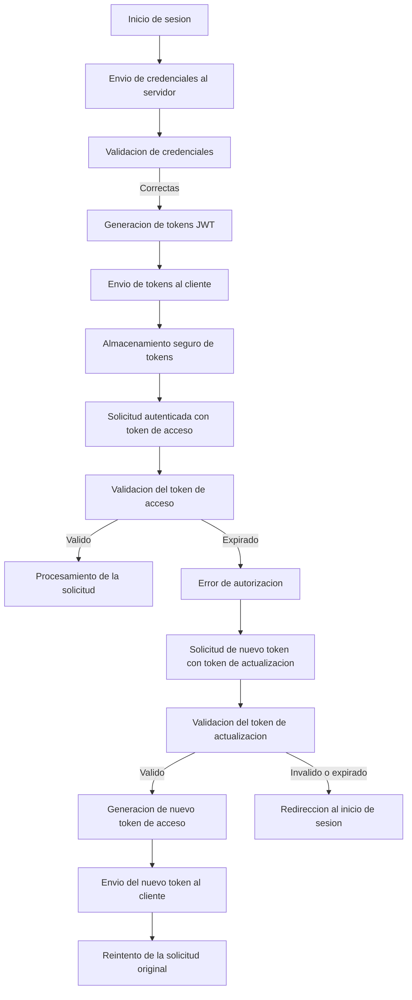
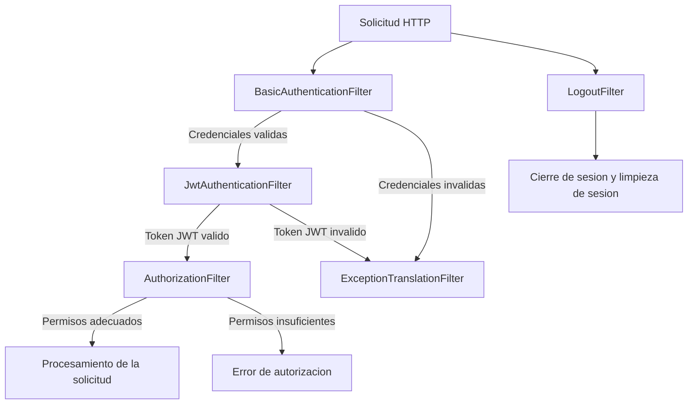

# Como funciona la autenticacion

La autenticacion esta basada en tokens JWT. Cuando un usuario inicia sesion, el servidor genera dos tokens: un token de acceso y un token de actualizacion. 
- El token de acceso tiene una duracion corta (por ejemplo, 15 minutos) y se utiliza para autenticar las solicitudes del usuario. - El token de actualizacion tiene una duracion mas larga (por ejemplo, 7 dias) y se utiliza para obtener nuevos tokens de acceso cuando el token de acceso ha expirado.

## Flujo de autenticacion

1. El usuario envia sus credenciales (nombre de usuario y contrasena) al servidor a traves del endpoint de inicio de sesion.
2. El servidor valida las credenciales. Si son correctas, genera un token de acceso y un token de actualizacion, y los envia al cliente.
3. El cliente almacena ambos tokens de forma segura (por ejemplo, en memoria o en almacenamiento seguro del navegador).
4. Para cada solicitud que requiera autenticacion, el cliente incluye el token de acceso en el encabezado de autorizacion.
5. El servidor valida el token de acceso. Si es valido, procesa la solicitud y devuelve la respuesta al cliente.
6. Si el token de acceso ha expirado, el servidor devuelve un error de autorizacion y el cliente utiliza el token de actualizacion para solicitar un nuevo token de acceso.
7. El servidor valida el token de actualizacion. Si es valido, genera un nuevo token de acceso y lo envia al cliente.
8. El cliente reemplaza el token de acceso antiguo con el nuevo y reintenta la solicitud original.
9. Si el token de actualizacion ha expirado o es invalido, el cliente redirige al usuario al proceso de inicio de sesion para obtener nuevos tokens.

## Seguridad
- Los tokens JWT estan firmados digitalmente para evitar manipulaciones.
- Es importante almacenar los tokens de forma segura para prevenir accesos no autorizados.
- Se recomienda utilizar HTTPS para todas las comunicaciones entre el cliente y el servidor para proteger los tokens durante la transmision.
- Los tokens de actualizacion deben tener una duracion limitada y pueden ser revocados por el servidor en caso de sospecha de compromiso.
- Se deben implementar mecanismos de seguridad adicionales, como la rotacion de tokens y la deteccion de actividades sospechosas.
- Los usuarios deben cerrar sesion manualmente para invalidar los tokens antes de su expiracion, si es necesario.
- Es recomendable monitorear y registrar los intentos de inicio de sesion y el uso de tokens para detectar posibles amenazas de seguridad.
- Se deben seguir las mejores practicas de seguridad para el manejo de tokens JWT, como evitar almacenarlos en lugares vulnerables (por ejemplo, localStorage) y utilizar cookies seguras con atributos HttpOnly y Secure.
- Los desarrolladores deben mantenerse actualizados sobre las vulnerabilidades conocidas relacionadas con JWT y aplicar parches o actualizaciones cuando sea necesario.
- Se recomienda implementar limites de tasa (rate limiting) para prevenir ataques de fuerza bruta en los endpoints de autenticacion.
- Es importante educar a los usuarios sobre la importancia de la seguridad de sus credenciales y tokens, y proporcionarles pautas para mantener su informacion segura.
- Se deben realizar auditorias de seguridad regulares para evaluar la efectividad de las medidas de seguridad implementadas y realizar mejoras continuas.

# Spring Security Filter Chains flows
Spring Security utiliza una cadena de filtros para manejar la autenticacion y autorizacion de las solicitudes HTTP. A continuacion se describen los principales flujos de la cadena de filtros:
1. **Autenticacion Basica**: El filtro `BasicAuthenticationFilter` intercepta las solicitudes que contienen encabezados de autorizacion basicos (Basic Auth). Valida las credenciales y, si son correctas, autentica al usuario. En este se le anexo un filtro personalizado para manejar el JWT por medio del Before `UsernamePasswordAuthenticationFilter`.
2. **JWT Authentication**: El filtro personalizado `JwtAuthenticationFilter` intercepta las solicitudes que contienen tokens JWT en los encabezados de autorizacion. Valida el token y, si es valido, autentica al usuario.
3. **Autorizacion**: El filtro `AuthorizationFilter` verifica si el usuario autenticado tiene los permisos necesarios para acceder al recurso solicitado. Si no tiene los permisos adecuados, devuelve un error de autorizacion.
4. **Manejo de Excepciones**: El filtro `ExceptionTranslationFilter` maneja las excepciones que ocurren durante el proceso de autenticacion y autorizacion, devolviendo respuestas adecuadas al cliente.
5. **Logout**: El filtro `LogoutFilter` maneja las solicitudes de cierre de sesion, invalidando la sesion del usuario y limpiando cualquier informacion relacionada con la autenticacion.

Estos flujos trabajan juntos para asegurar que solo los usuarios autenticados y autorizados puedan acceder a los recursos protegidos de la aplicacion.

# Diagrama de flujo de autenticacion

Este diagrama ilustra el flujo de autenticacion utilizando tokens JWT, desde el inicio de sesion hasta la gestion de tokens expirados y la redireccion al inicio de sesion cuando es necesario.
# Diagrama de flujo de Spring Security Filter Chains

Este diagrama ilustra el flujo de la cadena de filtros de Spring Security, desde la recepcion de una solicitud HTTP hasta el procesamiento de la solicitud o el manejo de errores relacionados con la autenticacion y autorizacion.
Sin embargo, es importante destacar que en este caso particular, se ha implementado un filtro personalizado para manejar la autenticacion mediante tokens JWT, y este filtro se integra en la cadena de filtros antes del `UsernamePasswordAuthenticationFilter`.
Este diagrama refleja la inclusion del filtro personalizado para JWT en el flujo de autenticacion de Spring Security.
